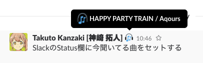

# Now Playing



Set the information of the song you are playing to the status of Slack.


## Support Player

**macOS (OS X) Only** (Because this application get current playing music information by Apple Script)

* iTunes
* [VOX](https://vox.rocks/)
* [Radiant Player](http://radiant-player.github.io/radiant-player-mac/)


## Getting Started

### Edit .environment file

```
cp env.environment .environment
```

Get your Slack parsonal token from [this page](https://api.slack.com/custom-integrations/legacy-tokens).

Add token on `SLACK_TOKEN=` line in .environment file.

### yarn install

```
yarn install
```

### Run App

```
yarn run start
```


## Roadmap

* Make an Electron Application
  * like a [uiureo/playing](https://github.com/uiureo/playing)


## License

[The MIT License](LICENSE)


## Author

* windyakin ([@MITLicense](https://twitter.com/MITLicense))
